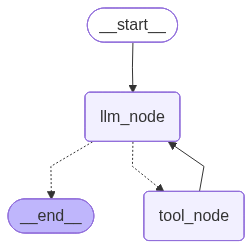
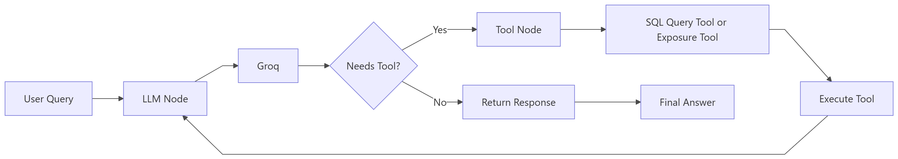

# Portfolio Analytics Agent - Project Guide

## Table of Contents
1. [Setup Instructions](#setup-instructions)
2. [Running the Agent](#running-the-agent)
3. [Project Structure](#project-structure)
4. [Agent Architecture](#agent-architecture)
5. [Important Notes](#important-notes)

---

## Setup Instructions

### Prerequisites
- Python 3.11 or higher
- pip package manager
- A Groq API key for Llama model

### Step 1: Create and Activate Virtual Environment

```bash
# Using uv (if installed)
uv venv

# Activate the virtual environment (Windows)
.\.venv\Scripts\Activate.ps1
```

### Step 2: Install Dependencies

```bash
# Option 1: Using requirements.txt
pip install -r requirements.txt

# Option 2: Using uv
uv pip install -r requirements.txt
```

### Step 3: Environment Configuration

Create a `.env` file in the project root directory and add your API key:

```
GROQ_API_KEY=your_api_key_here
```

You can obtain API keys from:
- Groq: https://console.groq.com/


### Step 4: Database Setup

The project uses SQLite with an in-memory or file-based database. The database is loaded from the CSV files in `data/csv_files/`.

---

## Running the Agent

### Run the Interactive Agent

To start the interactive portfolio analytics agent:

```bash
python run_agent.py
```

This will open an interactive command-line interface where you can ask questions about your portfolio. Example questions:

- "How many portfolios do we have?"
- "What is the sector exposure for portfolio 1?"
- "Show me the holdings in portfolio ABC"

Type `exit` to quit the agent.

### Run the Evaluator

To evaluate the agent's performance against the ground truth dataset:

```bash
python run_evaluation.py
```

This script will:
1. Load questions from `ground_truth_dataset.json`
2. Run each question through the agent
3. Compare the agent's response with the expected true answer
4. Display evaluation results including accuracy metrics

---

## Project Structure

```
portfolio-analytics-agent/
├── run_agent.py                     # Run interactive agent
├── run_evaluation.py                # Run evaluation script
├── requirements.txt                 # Python dependencies
├── pyproject.toml                   # Project metadata and dependencies
├── README.md                        # Task overview
│
├── data/                            # Data storage
│   ├── ground_truth_dataset.json    # Evaluation Q&A pairs with expected answers
│   ├── csv_files/                   # CSV data files
│   │   ├── benchmarks.csv           # Benchmark data
│   │   ├── historical_prices.csv    # Historical price information
│   │   ├── holdings.csv             # Portfolio holdings
│   │   ├── portfolio_performance.csv # Performance metrics
│   │   ├── portfolios.csv           # Portfolio metadata
│   │   ├── risk_metrics.csv         # Risk calculations
│   │   ├── sectors.csv              # Sector information
│   │   ├── securities.csv           # Security data
│   │   └── transactions.csv         # Transaction history
│   ├── db/                          # Database files (created runtime)
│   └── schema/
│       └── database_schema.sql      # SQLite schema definition
│
├── src/                             # Source code
│   ├── agent/
│   │   └── langgraph_workflow.py    # LangGraph agent workflow definition
│   │                                 # Contains: LLM node, Tool node, routing logic
│   ├── database/
│   │   ├── __init__.py
│   │   ├── db_connection.py         # Database connection management
│   │   ├── load_database.py         # Load CSV data into database
│   ├── evaluation/
│   │   └── evaluator.py             # Evaluation logic and metrics
│   ├── tools/
│   │   ├── exposure_tool.py         # Calculate sector exposure for portfolios
│   │   ├── sql_query_tool.py        # Convert questions to SQL queries
│   ├── utils/
│   │   ├── __init__.py
│   │   ├── helpers.py               # Utility helper functions
│   │   └── logger.py                # Logging configuration
│
├── experiments/                     # Experimental notebooks
│   ├── agent_trials/
│   │   ├── evalutor.ipynb           # Agent evaluation notebook
│   │   └── test.ipynb               # Test notebook
│   └── data_exploration/
│       └── data.ipynb               # Data exploration notebook
│
└── logs/                            # Application logs
    └── app.log                      # Main application log file
```

### Key Components

- **langgraph_workflow.py**: Orchestrates the agent workflow using LangGraph
- **exposure_tool.py**: Calculates sector-level portfolio exposure by weighting holdings
- **sql_query_tool.py**: Converts natural language questions to SQL queries
- **evaluator.py**: Runs evaluation against ground truth dataset
- **db_connection.py**: Manages SQLite database connections
- **load_database.py**: Initializes database from CSV files
- **logger.py**: Structured logging for debugging and monitoring

---

## Agent Architecture

### Workflow Diagram




### Component Interaction



### Agent Flow Details

1. **START**: User input enters the workflow
2. **LLM_NODE**: 
   - LLM receives the user query and chat history
   - LLM is bound with available tools
   - LLM decides to call a tool or generate a final response
3. **ROUTER LOGIC**:
   - Inspects last message for tool calls
   - Routes to TOOL_NODE if tools are called, otherwise routes to END
4. **TOOL_NODE**:
   - Executes SQL Query Tool (for database queries) or Exposure Tool (for calculations)
   - Returns tool results
   - Flow returns to LLM_NODE for response generation
5. **END**: Final response is delivered to user

### Available Tools

1. **SQL Query Tool** (`sql_query_tool.py`)
   - Converts natural language to SQL queries
   - Executes queries on the portfolio database
   - Use cases: Portfolio statistics, holdings lookup, price data

2. **Exposure Tool** (`exposure_tool.py`)
   - Calculates sector exposure percentages for a portfolio
   - Weights holdings by their portfolio allocation
   - Excludes bond holdings (equities only)
   - Output: Sector-level exposure percentages

---

## Important Notes

### API Key Configuration

The agent requires an API key to function:

1. **For Groq (Llama model)**: 
   - Get key from https://console.groq.com/
   - Set `GROQ_API_KEY` in `.env` file


The workflow uses Groq's Llama model by default (see `langgraph_workflow.py` line 24).

### Database

- SQLite is used for portfolio data storage
- CSV files in `data/csv_files/` are loaded into the database
- Schema is defined in `database_schema.sql`
- Database persists in `data/db/` directory

### Logging

- Application logs are stored in `logs/app.log`
- Configure logging level in `src/utils/logger.py`
- Useful for debugging agent execution and tool calls

### Evaluation

- Run evaluator with ground truth data: `python run_evaluation.py`
- Results show accuracy metrics comparing agent responses to expected answers
- Ground truth data is in `data/ground_truth_dataset.json`

---

